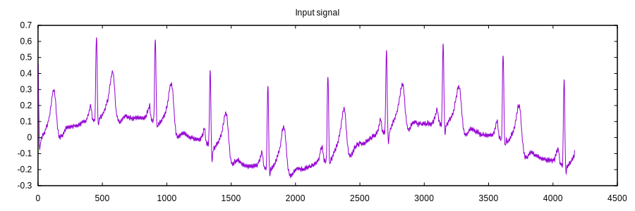
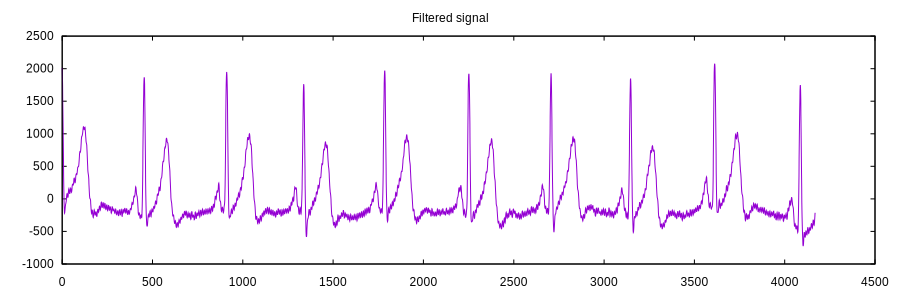
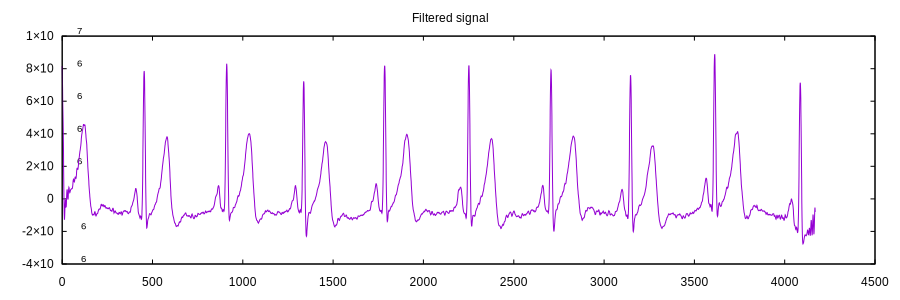

# ECG Analysis

This example is based on exercise from [Applied Signal Processing course](http://bme.elektro.dtu.dk/31610/?exercises/exercise3.html)

Please download data from the course page into the `data` folder

## Output

### Input signal

### Removing signals from muscle movement

### Removing 50 Hz interference

### Increasing the signal-to-noise ratio

### Finding the heart rate using autocorrelation